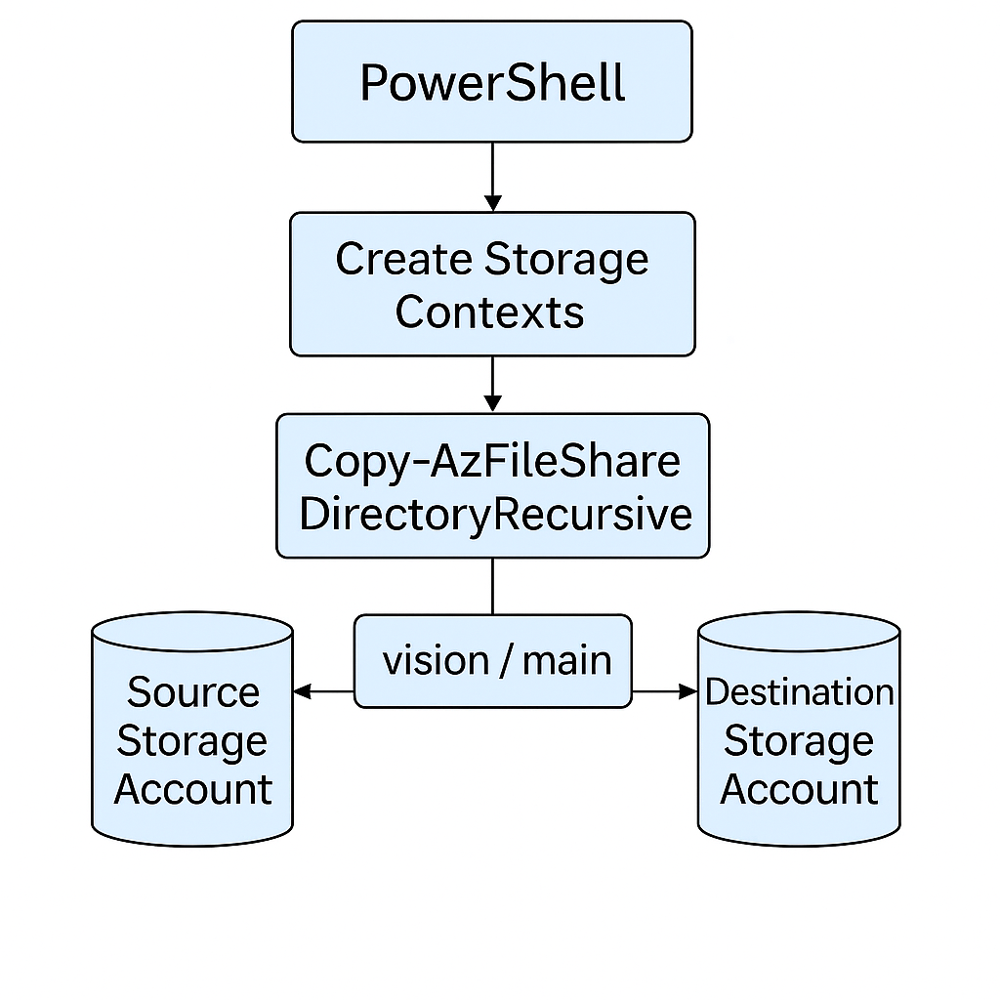

+-----------------------------+
| Terraform Module |
+-----------------------------+
| Variables: |
| - predefined_rules |
| - rules (map of configs) |
| - use_for_each |
+-------------┬---------------+
|
▼
+-----------------------------+
| azurerm_network_security_rule |
+-----------------------------+
| Dynamically created rules |
| with computed attributes |
| based on inputs and locals |
+-------------┬---------------+
|
▼
+-----------------------------+
| Azure Network Security Group |
+-----------------------------+

---

## 🔄 2. Flowchart: Rule Creation Process

```text
                ┌─────────────────────────────┐
                │   Start Module Execution    │
                └────────────┬────────────────┘
                             ↓
              ┌──────────────┴─────────────┐
              │  Loop over predefined_rules│
              └──────────────┬─────────────┘
                             ↓
              ┌──────────────┴───────────────┐
              │ Get rule config from var.rules│
              └──────────────┬───────────────┘
                             ↓
        ┌────────────────────┴────────────────────┐
        │ Compute rule attributes: protocol, ports │
        │ direction, access, prefixes, description │
        └────────────────────┬────────────────────┘
                             ↓
           ┌─────────────────┴──────────────────┐
           │ Compute priority based on direction│
           └─────────────────┬──────────────────┘
                             ↓
         ┌───────────────────┴────────────────────┐
         │ Create azurerm_network_security_rule   │
         └────────────────────────────────────────┘



```

+-----------------------------+
| Terraform Module |
+-----------------------------+
| Variables: |
| - predefined_rules |
| - rules (map of configs) |
| - use_for_each |
+-------------┬---------------+
|
▼
+-----------------------------+
| azurerm_network_security_rule |
+-----------------------------+
| Dynamically created rules |
| with computed attributes |
| based on inputs and locals |
+-------------┬---------------+
|
▼
+-----------------------------+
| Azure Network Security Group |
+-----------------------------+

---

## 🔄 2. Flowchart: Rule Creation Process

```text
                ┌─────────────────────────────┐
                │   Start Module Execution    │
                └────────────┬────────────────┘
                             ↓
              ┌──────────────┴─────────────┐
              │  Loop over predefined_rules│
              └──────────────┬─────────────┘
                             ↓
              ┌──────────────┴───────────────┐
              │ Get rule config from var.rules│
              └──────────────┬───────────────┘
                             ↓
        ┌────────────────────┴────────────────────┐
        │ Compute rule attributes: protocol, ports │
        │ direction, access, prefixes, description │
        └────────────────────┬────────────────────┘
                             ↓
           ┌─────────────────┴──────────────────┐
           │ Compute priority based on direction│
           └─────────────────┬──────────────────┘
                             ↓
         ┌───────────────────┴────────────────────┐
         │ Create azurerm_network_security_rule   │
         └────────────────────────────────────────┘


```

+-----------------------------+
| Terraform Module |
+-----------------------------+
| Variables: |
| - predefined_rules |
| - rules (map of configs) |
| - use_for_each |
+-------------┬---------------+
|
▼
+-----------------------------+
| azurerm_network_security_rule |
+-----------------------------+
| Dynamically created rules |
| with computed attributes |
| based on inputs and locals |
+-------------┬---------------+
|
▼
+-----------------------------+
| Azure Network Security Group |
+-----------------------------+

---

## 🔄 2. Flowchart: Rule Creation Process

```text
                ┌─────────────────────────────┐
                │   Start Module Execution    │
                └────────────┬────────────────┘
                             ↓
              ┌──────────────┴─────────────┐
              │  Loop over predefined_rules│
              └──────────────┬─────────────┘
                             ↓
              ┌──────────────┴───────────────┐
              │ Get rule config from var.rules│
              └──────────────┬───────────────┘
                             ↓
        ┌────────────────────┴────────────────────┐
        │ Compute rule attributes: protocol, ports │
        │ direction, access, prefixes, description │
        └────────────────────┬────────────────────┘
                             ↓
           ┌─────────────────┴──────────────────┐
           │ Compute priority based on direction│
           └─────────────────┬──────────────────┘
                             ↓
         ┌───────────────────┴────────────────────┐
         │ Create azurerm_network_security_rule   │
         └────────────────────────────────────────┘


```


